# RTL-Design-and-Synthesis-using-sky130

## Table of Contents

- [Day 1](#day-1)
  - [Introduction to open-source simulator iverilog](#introduction-to-open-source-simulator-iverilog)
  - [Labs using iverilog and gtkwave](#labs-using-iverilog-and-gtkwave)
  - [Introduction to Yosys and Logic synthesis](#introduction-to-yosys-and-logic-synthesis)
  - [Labs using Yosys and Sky130 PDKs](#labs-using-yosys-and-sky130-pdks)

- [Day 2](#day-2)
  - [Introduction to timing .libs](#introduction-to-timing-libs)
  - [Hierarchical vs Flat Synthesis](#hierarchical-vs-flat-synthesis)
  - [Various Flop Coding Styles and optimization](#various-flop-coding-styles-and-optimization)

- [Day 3](#day-3)
  - [Introduction to optimizations](#introduction-to-optimizations)
  - [Combinational logic optimizations](#combinational-logic-optimizations)
  - [Sequential logic optimizations](#sequential-logic-optimizations)
  - [Sequential optimizations for unused outputs](#sequential-optimizations-for-unused-outputs)

- [Day 4](#day-4)
  - [GLS, Synthesis-Simulation mismatch and Blocking/Non-blocking statements](#gls-synthesis-simulation-mismatch-and-blockingnon-blocking-statements)
  - [Labs on GLS and Synthesis-Simulation Mismatch](#labs-on-gls-and-synthesis-simulation-mismatch)
  - [Labs on synth-sim mismatch for blocking statements](#labs-on-synth-sim-mismatch-for-blocking-statements)

- [Day 5](#day-5)
  - [If Case constructs](#if-case-constructs)
  - [Labs on "Incomplete If Case"](#labs-on-incomplete-if-case)
  - [Labs on "Incomplete overlapping Case"](#labs-on-incomplete-overlapping-case)
  - [for loop and for generate](#for-loop-and-for-generate)
  - [Labs on "for loop" and "for generate"](#labs-on-for-loop-and-for-generate)
---
## Day 1
## Topic : Introduction to Verilog, Simulation, and Synthesis
# Tools Introduced : Icarus , GTKWave , Yosys
# Installation Commands (macOS – using Homebrew)

```bash
> brew install iverilog
> brew install gtkwave
> brew install yosys
```

### Introduction to open-source simulator iverilog

- Simulator: Tool to check our RTL Design(Implementation of a spec).
- Open-source Verilog simulation and compilation tool.
- Used to compile Verilog design files and generate simulation results.
- TestBench: Setup to apply stimulus to the design to check its functionality.
- GTKWave: Tool to view waveform output for the given inputs( to verify functionality).
- VCD file: Value Change Dump file/format.
- Simulator looks for the changes in the input and then dumps the changes to the output.

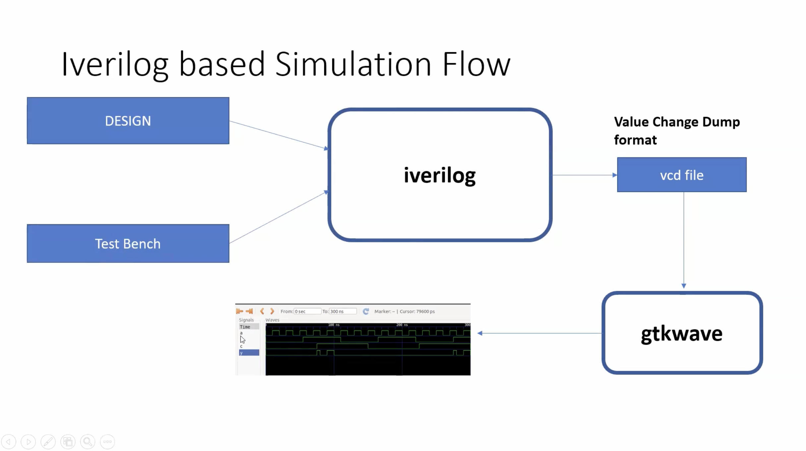


### Labs using iverilog and gtkwave

- Environment Setup:

- Create a directory named VLSI.
  
```bash
> git clone https://github.com/kunalg123/sky130RTLDesignAndSynthesisWorkshop
```

VSD Workflow 

```bash

VLSI
.
├── sky130RTLDesignAndSynthesisWorkshop
   ├── DC_WORKSHOP
   │   ├── lib
   │   ├── README.md
   │   └── verilog_files
   ├── lib (library files)
   │   └── sky130_fd_sc_hd__tt_025C_1v80.lib (std cell library)
   ├── my_lib
   │   └── verilog_model (std cell verilog models)
   ├── README.md
   ├── verilog_files (lab experiments , testbench files)
   │   ├── good_mux.v
   │   ├── good_counter.v
   │   ├── bad_counter.v
   │   ├── tb_good_mux.v
   │   ├── tb_good_mux.vcd
   │           .
   │           .
   │           .
   └── yosys_run.sh
```

- Waveform viewer for displaying signal changes over time from simulation output.
- Used to analyze `.vcd` (Value Change Dump) files generated by simulations.

 ## Loading design to iverilog:

 Eg : good_mux.v tb_good_mux.v

Step 1: 
```bash
> iverilog design name.v testbench-associated.v
eg: > iverilog good_mux.v tb_good_mux.v
```
- A file will be generated:

```bash
a.out (file generated)
```
Step 2 : Execute a.out
```bash
> ./a.out
```
- A Vcd file will be generated. For this example:
```bash
tb_good_mux.vcd will be generated
```
Step 3: Load it to simulator

```bash
> gtkwave tb_good_mux.vcd
```
- View the waveform to check then input and output of the design.

## File structure/content lookup:

```bash
> gvim/vim (filename.v)
> gvim/vim good_mux.v
> gvim/vim tb_good_mux.v
```

### Introduction to Yosys and Logic synthesis

- Open-source framework for Verilog synthesis.
- Converts RTL designs into gate-level netlists.

Working:

Commands:

```bash
read_verilog : read design
read_liberty : read library
write_verilog : write out netlist
```

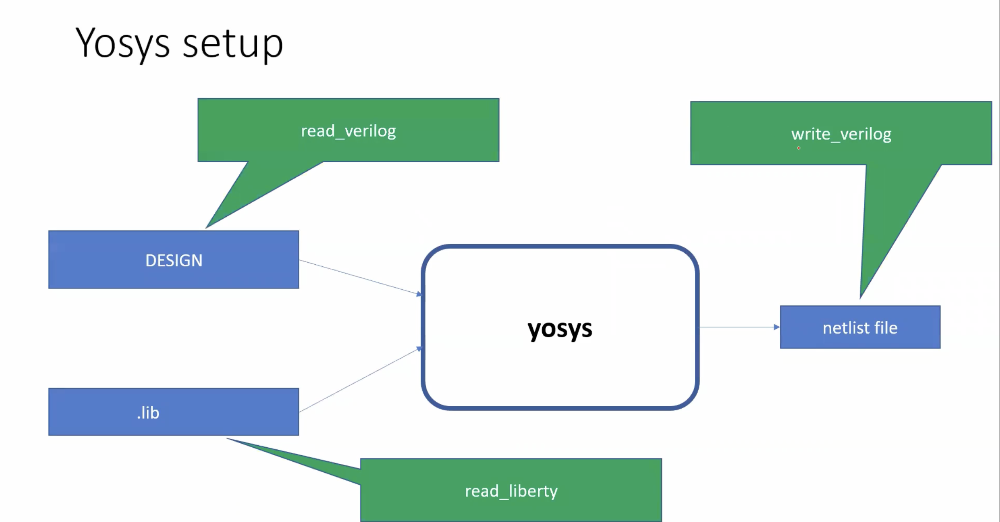

## How to verify synthesis correctness?

- Having netlist (verilog code in terms of standard cells) and testbench (same as RTL Design's TestBench) , these being inputs for the simulator gives out the VCD file which can be used to verify using GTKWave.


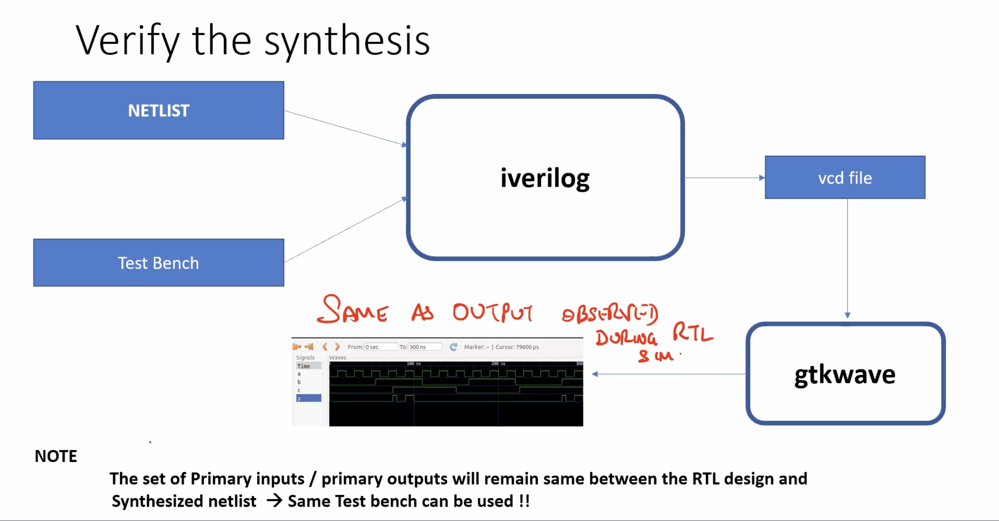

### Labs using Yosys and Sky130 PDKs : How to invoke Yosys and synthesize the design

To invoke yosys:

```bash

> yosys
```


### Inside Yosys Prompt:

# 1. Command to read library:

```bash
> read_liberty -lib lib/sky130....lib
```
# 2. Command to read design:

```bash
> read_verilog filename.v
> read_verilog good_mux.v (example)
```
" Successfully finished Verilog Frontend." message should pop-up after the command.
```
> synth -top ( module needed to be synthesized)
> synth -top good_mux (example)
```
# 3. Command to generate netlist

```bash
> abc -liberty lib/sky....lib (convert RTL to gates accordinly from library)
```
ABC identifies the inputs and the cells used to build the design from the library.

# 4. Command for logic realised:

```
> show
```

# 5. Command to write netlist:

```
> write_verilog filename_netlist.v
> write_verilog good_mux_netlist.v (example)
```

```
write_verilog -noattr good_mux_netlist.v (simplified netlist)
```

---
## Day 2

## Topic : Timing libs, Hierarchical vs Flat Synthesis and Efficient Flop Coding Styles

### Introduction to timing .libs

- Library walk-through
 
## sky130_fc_sc_hd_tt_025C_1v80.lib is the library name

1. 130 - 130nm
2. tt - typical ( can be slow , fast or typical)
3. 025C - temperature
4. 1v8 - Voltage

## Important terminologies for a design to work

P V T
P - Process
V - Voltage
T - Temperature

Variations will be there according to PVT ( determines how Si is going to work)

Eg: CD Player produced and sold in Switzerland , Dubai , India
Dubai ( temp > 30 - 50c)
Switzerland (temp < 20 or maybe negative)
But CD Player should work irrespective of temp variations!

- There will be lot of cells in the library that has usage of multiple gates in multiple combinations.
- Has features of the cell (leakage power, area, power port info, transition , delay according to pins , timing information etc)
##  For example: cell("sky130_fd_sc_hd_and2_0")

- Two inputs - A and B (4 possible states) 
- Output - X
- 3 different areas are found w.r.t and2_0 , and2_2 , and 2_4

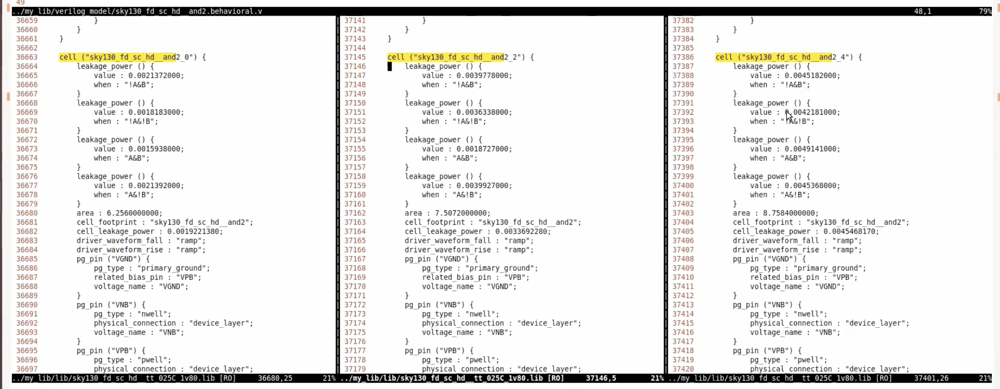

## Larger area => wider transistor usage
- Wider cells are faster but has large area and power usage.
## Smaller area => narrow transistor usage
- Narrow cells have delay more and area is less.

### Hierarchical vs Flat Synthesis

# example: multiple_modules.v
```
module sub_module2 (input a, input b, output y);
        assign y = a | b;
endmodule

module sub_module1 (input a, input b, output y);
        assign y = a&b;
endmodule

module multiple_modules (input a, input b, input c , output y);
        wire net1;
        sub_module1 u1(.a(a),.b(b),.y(net1));  //net1 = a&b
        sub_module2 u2(.a(net1),.b(c),.y(y));  //y = net1|c ,ie y = a&b + c;
endmodule

```
- module sub_module1 - AND gate (instantiated as u1)
- module sub_module2 - OR gate  (instantiated as u2)

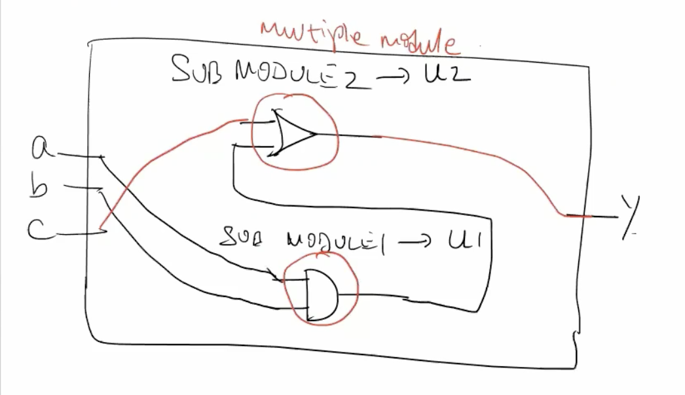

# Synthesizing multiple_modules.v

```
> read_liberty -lib lib/sky....lib
> read_verilog multiple_modules.v
> synth -top multiple_modules
> abc -liberty lib/sky....lib
> show

```
# synth -top multiple_modules output:

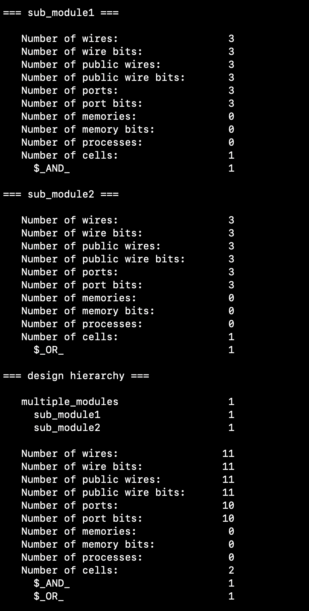

- Inferred sub-module1 has 1 AND gate.
- Inferred sub-module2 has 1 OR gate.
- Top module has sub-module 1 and 2 instances.

# abc -liberty lib/sky...lib output:

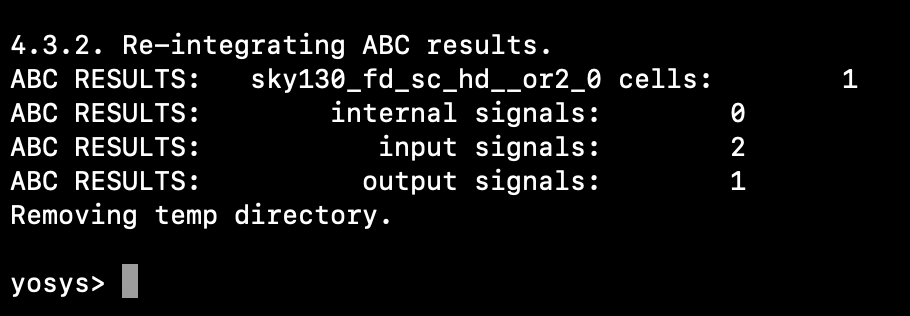

```
> show multiple_modules
```
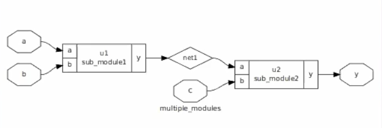

- Interestingly , it does not show AND and OR gate but shows as u1 and u2 which are the instantiations. This is called Hierarchial design!!
```
> write_verilog multiple_modules_hier.v
> exit
> vim/gvim multiple_modules_hier.v
```
# multiple_modules_hier.v

```
/* Generated by Yosys 0.53 (git sha1 53c22ab7c0ced80861c7536c5dae682c30fb5834, clang++ 17.0.0 -fPIC -O3) */

(* top =  1  *)
(* src = "verilog_files/multiple_modules.v:10.1-14.10" *)
module multiple_modules(a, b, c, y);
  (* src = "verilog_files/multiple_modules.v:10.32-10.33" *)
  input a;
  wire a;
  (* src = "verilog_files/multiple_modules.v:10.41-10.42" *)
  input b;
  wire b;
  (* src = "verilog_files/multiple_modules.v:10.50-10.51" *)
  input c;
  wire c;
  (* src = "verilog_files/multiple_modules.v:11.7-11.11" *)
  wire net1;
  (* src = "verilog_files/multiple_modules.v:10.61-10.62" *)
  output y;
  wire y;
  (* module_not_derived = 32'd1 *)
  (* src = "verilog_files/multiple_modules.v:12.14-12.38" *)
  sub_module1 u1 (
    .a(a),
    .b(b),
    .y(net1)
  );
  (* module_not_derived = 32'd1 *)
  (* src = "verilog_files/multiple_modules.v:13.14-13.38" *)
  sub_module2 u2 (
    .a(net1),
    .b(c),
    .y(y)
  );
endmodule

(* src = "verilog_files/multiple_modules.v:5.1-7.10" *)
module sub_module1(a, b, y);
  (* src = "verilog_files/multiple_modules.v:5.27-5.28" *)
  wire _0_;
  (* src = "verilog_files/multiple_modules.v:5.36-5.37" *)
  wire _1_;
  (* src = "verilog_files/multiple_modules.v:5.46-5.47" *)
  wire _2_;
  (* src = "verilog_files/multiple_modules.v:5.27-5.28" *)
  input a;
  wire a;
  (* src = "verilog_files/multiple_modules.v:5.36-5.37" *)
  input b;
  wire b;
  (* src = "verilog_files/multiple_modules.v:5.46-5.47" *)
  output y;
  wire y;
  sky130_fd_sc_hd__and2_0 _3_ (
    .A(_1_),
    .B(_0_),
    .X(_2_)
  );
  assign _1_ = b;
  assign _0_ = a;
  assign y = _2_;
endmodule

(* src = "verilog_files/multiple_modules.v:1.1-3.10" *)
module sub_module2(a, b, y);
  (* src = "verilog_files/multiple_modules.v:1.27-1.28" *)
  wire _0_;
  (* src = "verilog_files/multiple_modules.v:1.36-1.37" *)
  wire _1_;
  (* src = "verilog_files/multiple_modules.v:1.46-1.47" *)
  wire _2_;
  (* src = "verilog_files/multiple_modules.v:1.27-1.28" *)
  input a;
  wire a;
  (* src = "verilog_files/multiple_modules.v:1.36-1.37" *)
  input b;
  wire b;
  (* src = "verilog_files/multiple_modules.v:1.46-1.47" *)
  output y;
  wire y;
  sky130_fd_sc_hd__or2_0 _3_ (
    .A(_1_),
    .B(_0_),
    .X(_2_)
  );
  assign _1_ = b;
  assign _0_ = a;
  assign y = _2_;
endmodule

```

```
> write_verilog -noattr multiple_modules_hier.v
> exit
> vim/gvim multiple_modules_hier.v
```

# multiple_modules_hier.v ( with -noattr)

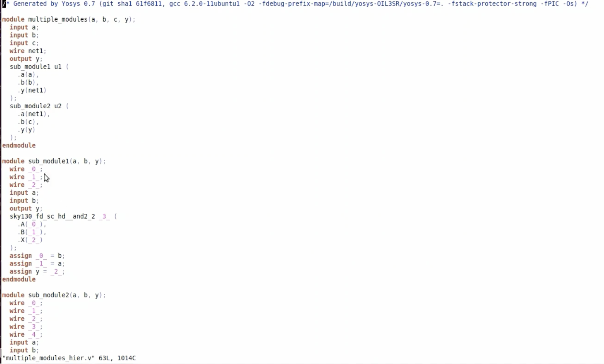

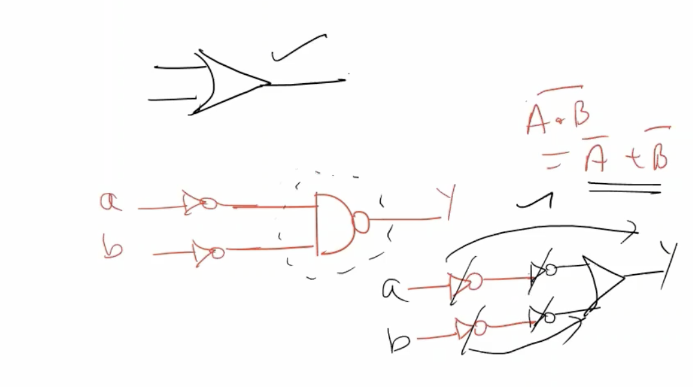

- NAND Gate = Stacked N-MOS + Parellel P-MOS
- NOR Gate = Stacked P-MOS + Parellel N-MOS
- STACKED P-MOS = BAD!! (P-MOS has poor mobility and to improve this , we need to use wider transistors).

# Flattened netlist 

```
> flatten
> write_verilog multiple_modules_flat.v
> exit
> vim/gvim verilog_files/multiple_modules_flat.v

```
# multiple_modules_flat.v

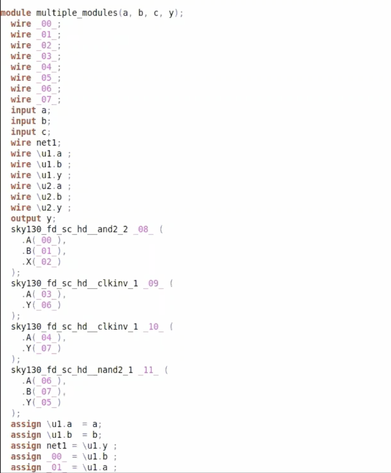

- Direct instantiation of OR and AND gate is found and there is no u1 and u2 instantiation just like in hierarchial!

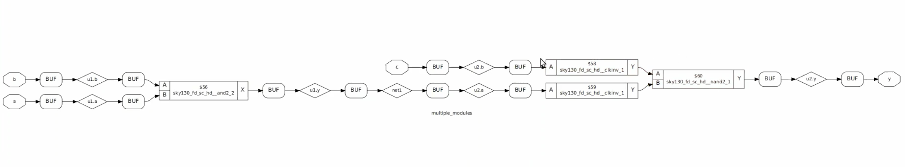

# Sub-Module Level Synthesis

```
> yosys
> read_liberty -lib lib/sky....lib
> read_verilog verilog_files/multiple_modules.v
> synth -top sub_module1
> abc -liberty lib/sky...lib
> show
  ```
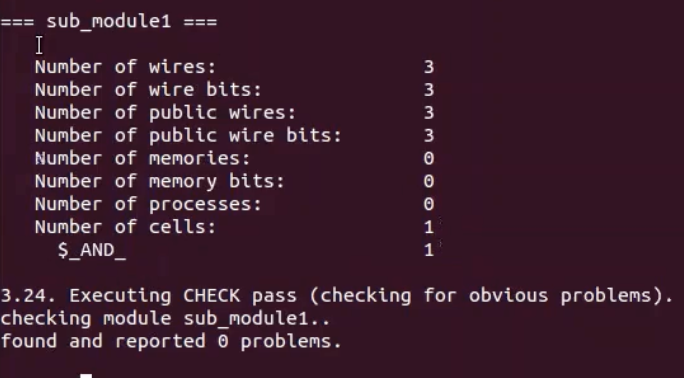

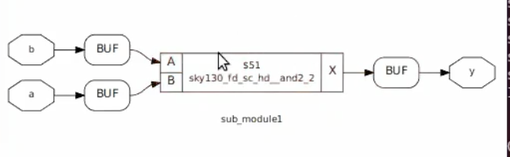

- sub module 1 alone will be seen but not the other modules.

# Why sub-module level synthesis?

- Preferred when we have multiple instances of the same module.
- When we want to do divide and conquer approach ( Design is massive and tool not able to do its job.)

### Various Flop Coding Styles and optimization

- How to code a flop / Different coding styles for flops
- Files location : verilog_files/ff.v

# Why flops?
- When input is given to a combinational circuit, ouput is going to change after a propagation delay.
- Propagatio delay = glitch

  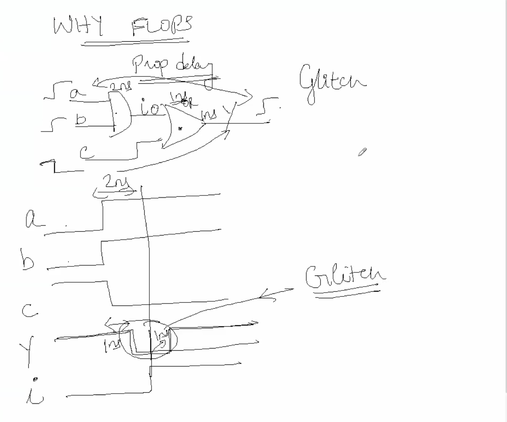

- In the above example , a and b are inputs of AND gate with a delay of 2 ns and i0 is the output wire of a and b. i0 is OR-ed with c input with a delay of 1ns. The waveform depicts the difference of 1 ns(momentarily y , the output goes low) which is called a GLITCH.

- More combinationa circuits , more glitchy which is evident from above example.
- To avoid glitches , we need a memory element that can store the value , which are called FLOPS.
- Flop output changes only on the edge of the clock (even if inputs are glitchy , output will be stable).

# How to code a Flop?

Note: Initialize the flop (reset or set which can be either synchronous or asynchronous)

  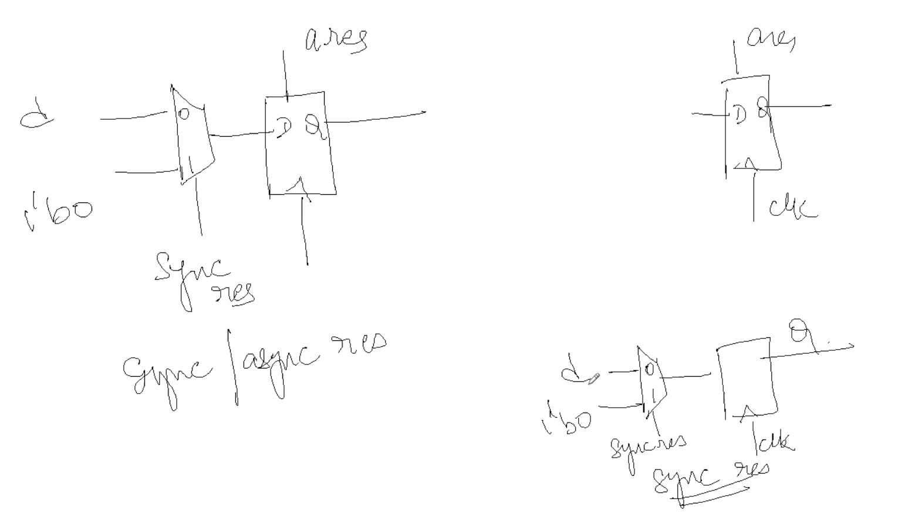

1. Flop with asynchronous (does not wait/irrespective of a clock) reset [`dff_asyncres.v`](./dff_asyncres.v)
2. Flop with asynchronous (does not wait/irrespective of a clock) set   [`dff_asyncset.v`](./dff_asyncset.v)
3. Flop with synchronous (does not wait/irrespective of a clock) reset  [`dff_synch.v`](./dff_synch.v)
4. Flop with synchronous and asynchronous reset  [`dff_synch_asynch.v`](./dff_synch_asynch.v)

# Synthesis of Flops

```
> yosys
> read_liberty -lib lib.sky...lib
> read_verilog dff_asyncres.v tb_dff_ayncres.v
> synth -top dff_ayncres
> dfflibmap -liberty lib/sky...lib (looks only for dff)
> abc -liberty lib/sky...lib
> show

```
 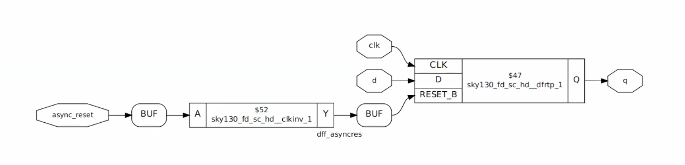

 # Interesting optimization

- Files : mult_2.v and mult_8.v
- Case - mult_2.v
```
module mult_2 (input [2:0] a , output [3:0} y);
assign y = a*2;
endmodule
```
 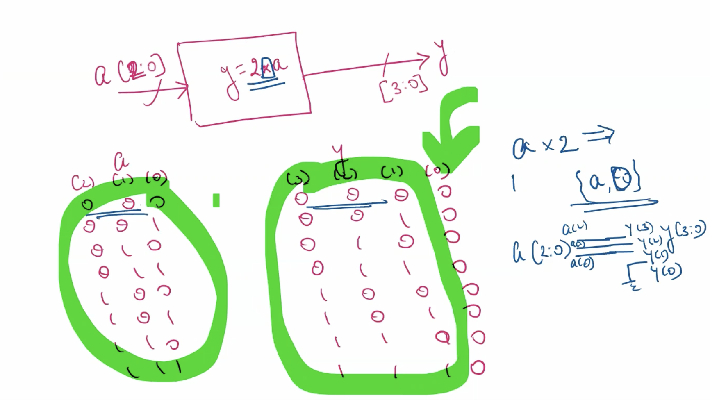  

 - We come to know that:
- (any number) * 2 = the number appended with one 0.
- (any number) * 4 = the number appended with two 0s.
- (any number) * 8 = the number appended with three 0s.

# Result in synthesizer:
- No cells will be synthesized and it can be inferred from the output.

```
> yosys
.
.
.
```
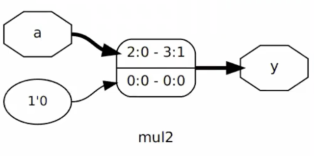

- Taking another example in mind:
```
module mult8 (input [2:0] a , output [5:0] y);
assign y = 9 * a;
endmodule
```  
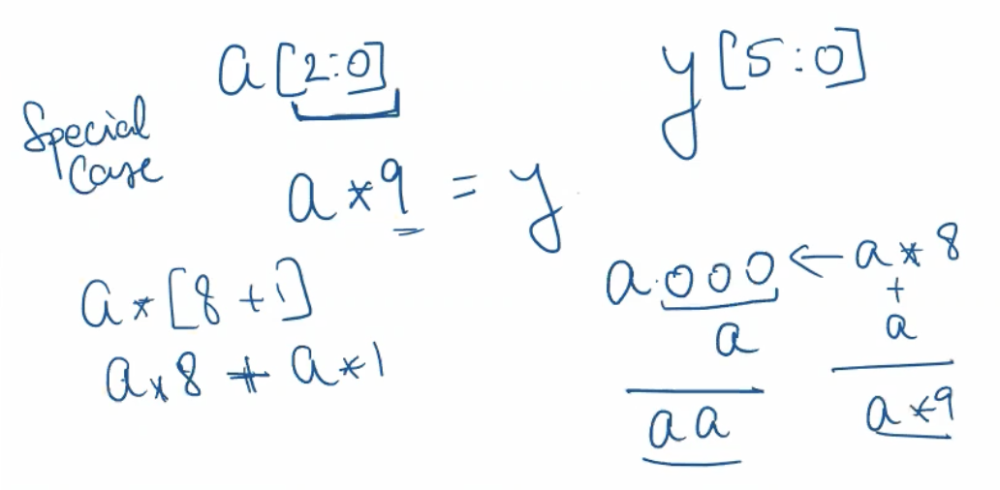

- We also have the netlist below:

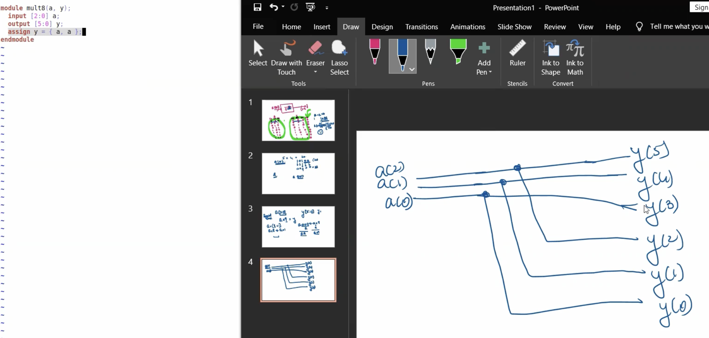

---

## Day 3

### Introduction to optimizations

- These are of two types ├──> Combinational
                         |--> Sequential
# Intro to Combinational:
- Optimizations done over squeezing to get the most optimized design (efficient in terms of area , power)
- Techniques: 1. Constant propagation ( Direct optimisation)
              2. Boolean Logic optimisation ( K-Map etc)

- Constant Propagation optimisation

Taking an example, say , Y = ((AB) + C)' which on reducing will come down to => Y = C' (when A = 0)
So , now drawing the circuit would give us usage of 6 MOS Transistors fro the above equation . But for the condition when A = 0 , we need only an invertor which takes only 2 MOS transistors which is the most optimised design.

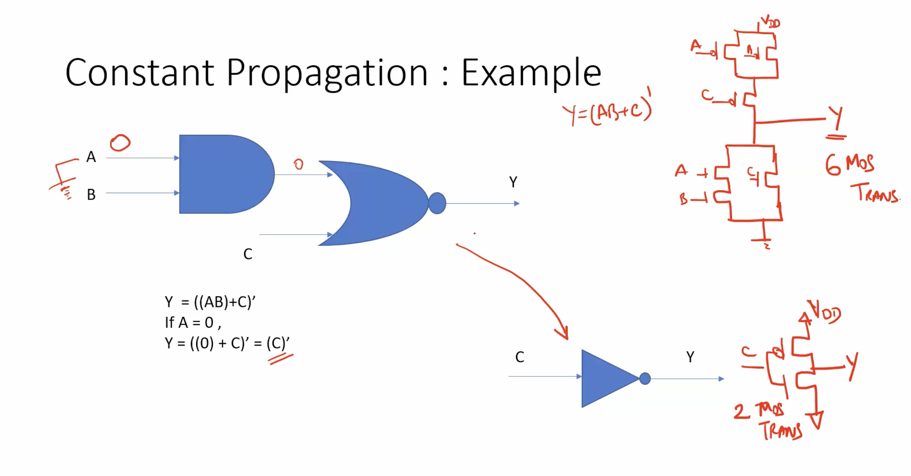

- Boolean logic optimisation

Taking an example again: > assign y = a?(b?c:(c?a:0)):(!c)

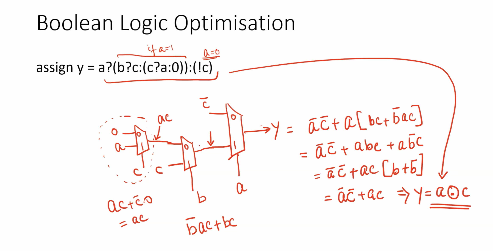

- Synthesis tools does this kind of Boolean reduction of expression to come up with the best optimised solution!!

# Intro to sequential:

- Basic one -> Sequential Constant Propagation
- Advanced one -> 1. State optimisation | 2. Retiming | 3. Sequnetial Logic Cloning ( Floor Plan Aware Analysis)

- Sequential Constant Propagation (Basic One)
  Taking D-FF , D input tied low with a reset and Q connected to NAND gate as one of the inputs and A as another input woth output Y. Will Q become 1?
  NO. Considering the reset signal , Q will always be 0 and hence Y will always be 1.
  Hence , we can infer that Q is taking up a constant value which is why this is Sequential Constant. 

  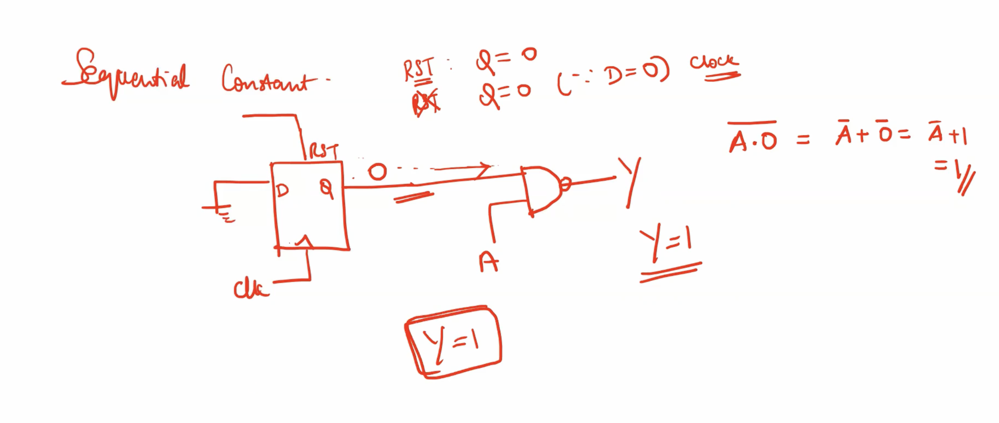
  
 - Taking another case , where Set signal is considered in the above example. So , Q will be asynchronously be 1 (set) and when Set signal goes low , Q synchronously goes low. This shows that there is a necessity for the D-FF to be there in the circuit as Set can be both 0 or 1.
 - Hence , we can infer that Q is not taking up a constant value which is why this is not a Sequential Constant. ( Not everytime an input tied up with 0 will have an output 0 only. Considering other factors like clock , set/reset signal is needed).

  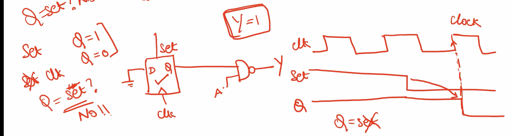

# Advanced sequential optimisations: (Theory)

  - State Optimisation: Optiimisation of unused state
    
  - Cloning: When doing a physical aware synthesis.
    
    Example: 3 Flops A,B,C are present. A combinational logic output is connected to A input and there is one more combinational logic that is present before B and C flops. ( Reference in below example picture). Considering to place this on a floorplan there will be a huge routing delay for A to travel to B as well as C. So considering a case where a huge positive slack is there for A and hence A value is basically cloned and now there are 2 copies of A one each for B and C. So , now the timing is met and there is no much greater delay.

     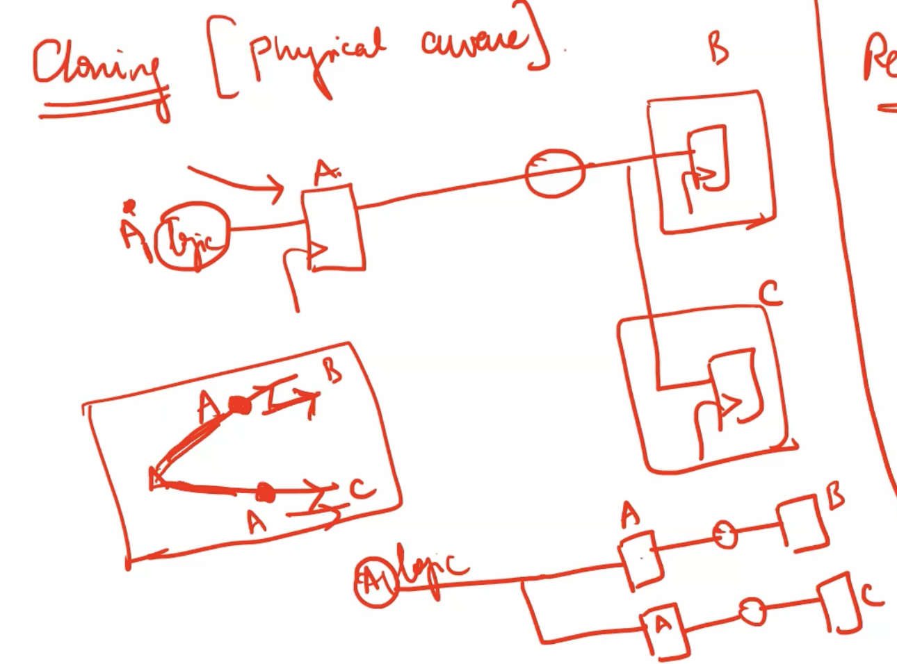
    
  - Retiming:

     In the below example , the logic has 5ns and 2ns delay respectively which clock at freq of 200MHz and 500MHz respectively which gives overall clock of 200MHz. So, to improve this , we try splitting the delay in such a way that clock can be increased. This is called retiming. So , now splitting the delay as 4ns and 3 ns gives us a freq of 250MHz and 333MHz respectively which gives out a output clock of 250 MHz.
  
  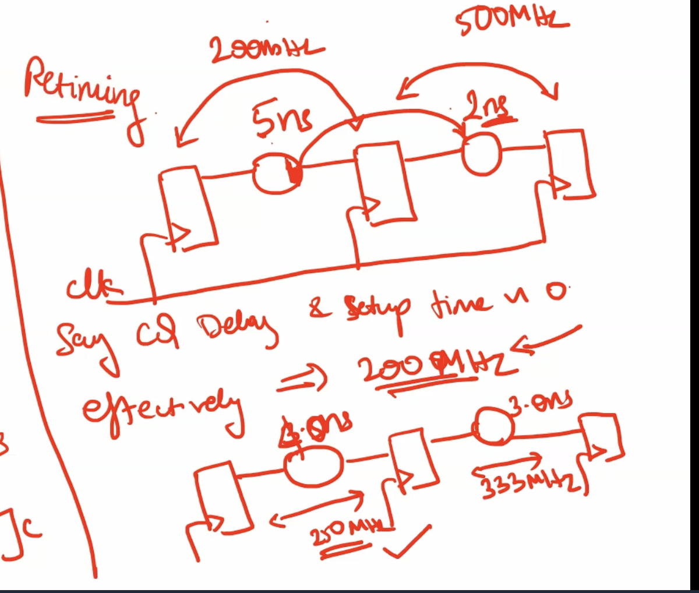

### Combinational logic optimizations 

- Labs
- Files used : opt named files (opt_check)
  
# opt_check
```
module opt_check(input a , input b , output y )
assign y = a?b:0;
endmodule
```
# opt_check2

```
module opt_check2(input a , input b, output y)
assign y = a?1:b;
endmodule
```
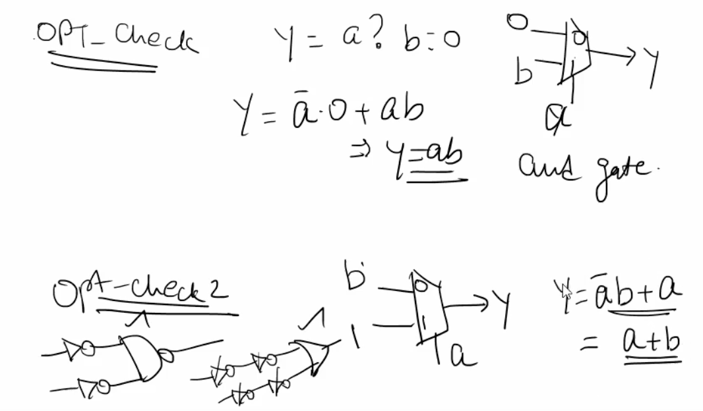

- From the above, we can understand that opt-check2 is actually Consensus Theorem.

# opt_check3

```
module opt_check3(input a , input b,inout c, output y)
assign y = a?(c?b:0):0;
endmodule
```
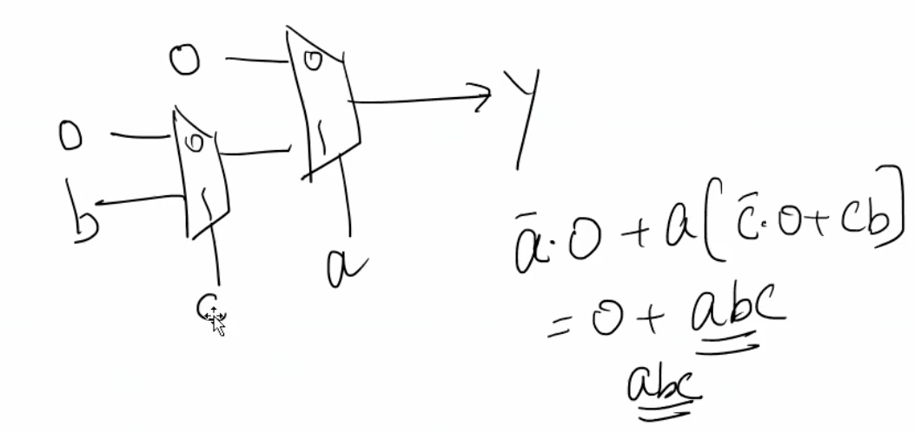


# Synthesis - opt_check
- opt_check:
```
yosys
read_liberty -lib lib/sky...lib
read_verilog opt_check.v
synth -top opt_check
opt_clean -purge (constant prop and optimisation command)
abc -liberty lib/sky...lib
show
```
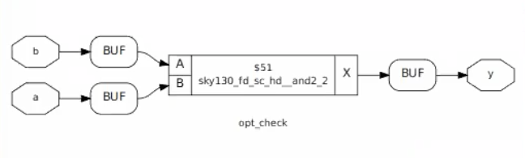

- opt_check2:
  
```
read_verilog opt_check2.v
synth -top opt_check2
opt_clean -purge
abc -liberty lib/sky...lib
```
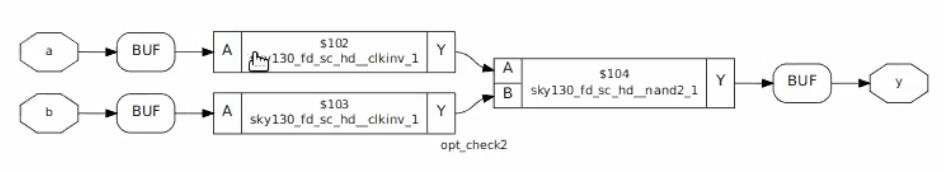

- opt_check3
```
read_verilog opt_check3.v
synth -top opt_check3
opt_clean -purge
abc -liberty lib/sky...lib
```

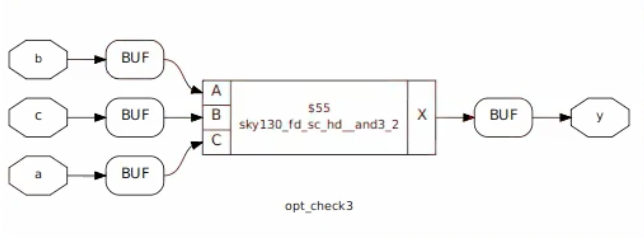

### Sequential logic optimizations 

- Labs
- Files : *dff_const* (command to search in a directory) named files

# dff_const1.v

```
module dff_const1(input clk, input reset, output reg q);
always @(posedge clk, posedge reset)
begin
        if(reset)
                q <= 1'b0;
        else
                q <= 1'b1;
end

endmodule
```
# dff_const2.v

```
module dff_const2(input clk, input reset, output reg q);
always @(posedge clk, posedge reset)
begin
        if(reset)
                q <= 1'b1;
        else
                q <= 1'b1;
end

endmodule

```

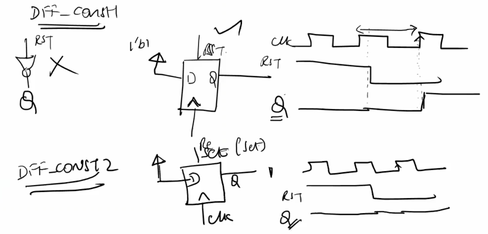

# dff_const3.v

```
module dff_const3(input clk, input reset, output reg q);
reg q1;

always @(posedge clk, posedge reset)
begin
        if(reset)
        begin
                q <= 1'b1;
                q1 <= 1'b0;
        end
        else
        begin
                q1 <= 1'b1;
                q <= q1;
        end
end

endmodule
```
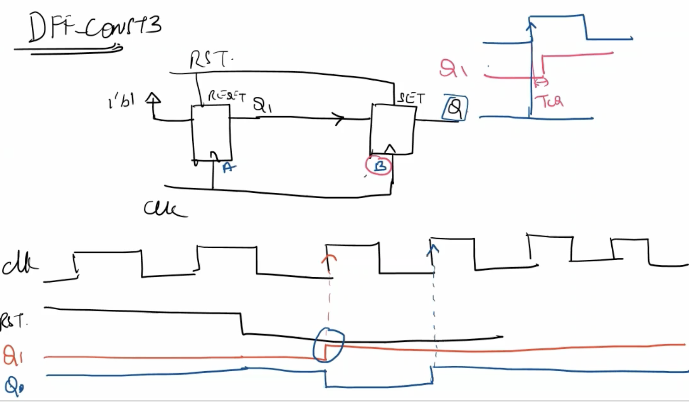

# Synthesis of dff_const1

```
read_verilog dff_const1.v
synth -top dff_const1
dfflibmap -liberty lib/sky....130
abc -liberty lib/sky...lib
show
```
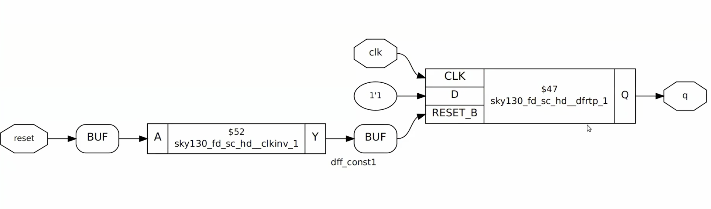

# Synthesis of dff_const2

```
read_verilog dff_const2.v
synth -top dff_const2
dfflibmap -liberty lib/sky....130
abc -liberty lib/sky...lib
show
```
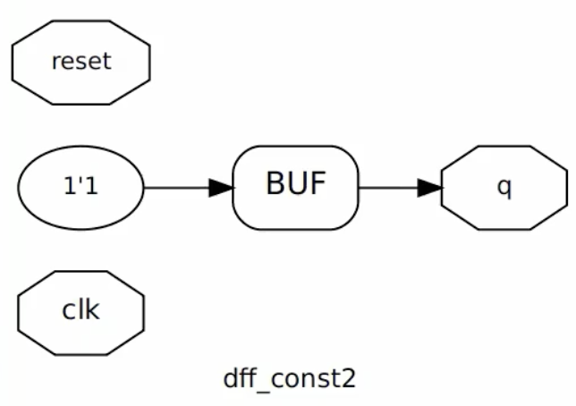

# Synthesis of dff_const3

```
read_verilog dff_const3.v
synth -top dff_const3
dfflibmap -liberty lib/sky....130
abc -liberty lib/sky...lib
show
```
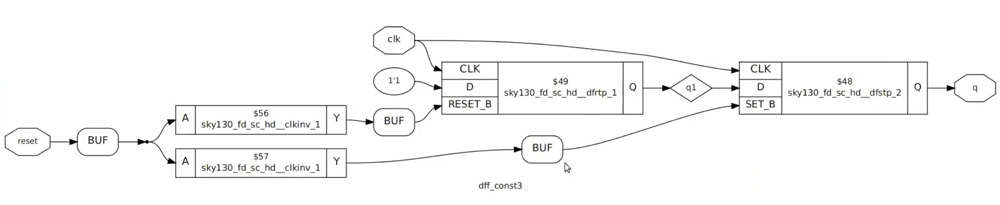

### Sequential optimizations for unused outputs

- Unused output optimisation
  
# counter_opt.v

```
module counter_opt (input clk , input reset , output q);
reg [2:0] count;
assign q = count[0];

always @(posedge clk ,posedge reset)
begin
        if(reset)
                count <= 3'b000;
        else
                count <= count + 1;
end

endmodule
```
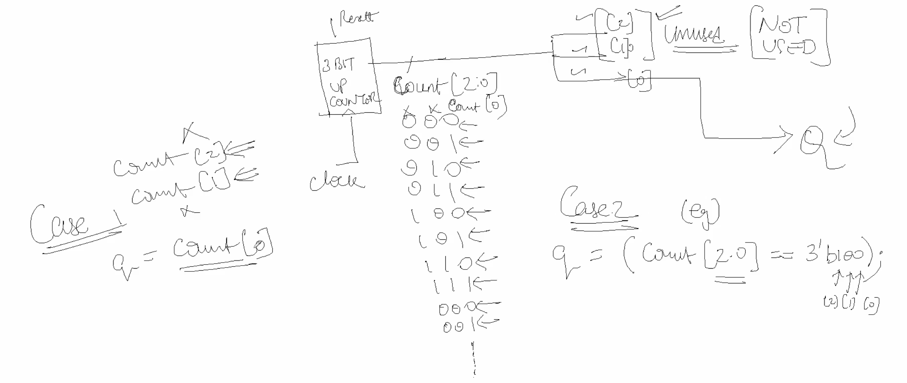

# Synthesis of counter_opt.v

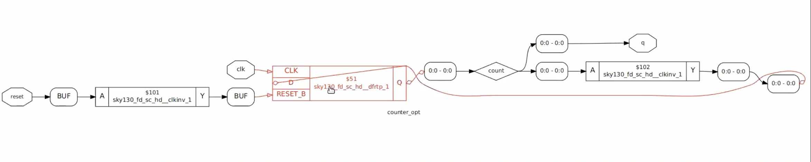


---

## Day 4

### GLS, Synthesis-Simulation mismatch and Blocking/Non-blocking statements

# What is GLS - Gate Level Simulation

- Running the testbench with netlist (same as RTL Code) as Design Under Test. (inputs and outputs of RTL code and netlist are the same!!!)

# Why GLS?

1. Verify logical correctness of design after synthesis
2. Ensuring the timing of the design is met. ( Setup , hold time are met etc)
Note: To run GLS for timing, we need to run it with GLS Annotation.

# GLS Using iVerilog

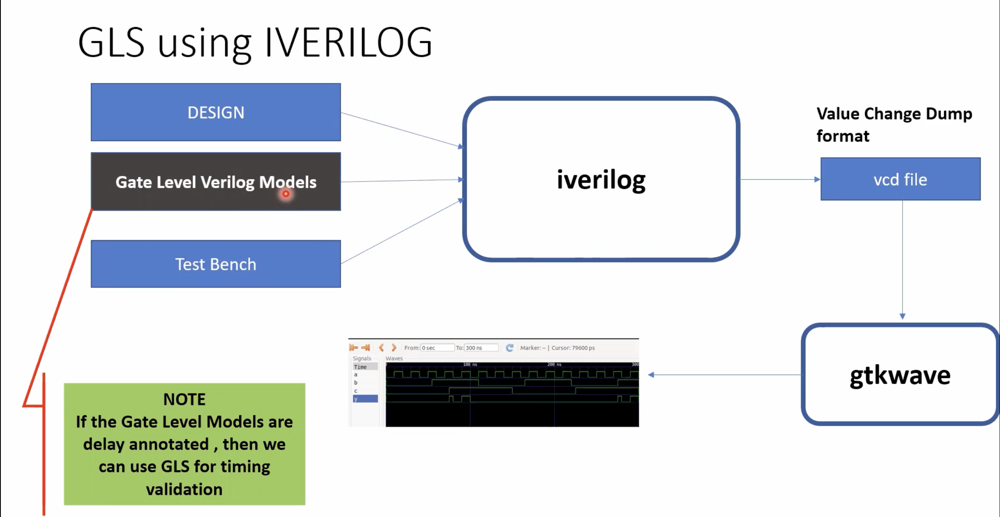


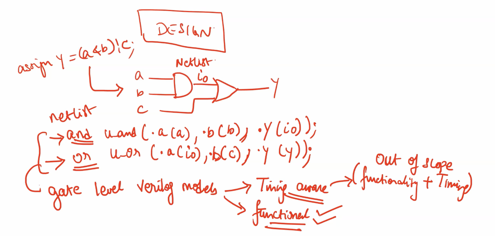

# Synthesis Simulation Mismatch

- Why it happens?
1. Missing sensitivity list
2. Blocking and non blocking assignment
3. Non standard verilog coding
   
# 1. Missing sensitivity list

- How simulator works?
- Works based on activity. -> Output changes according to input change.
```
module mux(input i0 , input i1, input sel , output reg y);
always@(sel) (whenever sel changes)
begin
if(sel)  (sel is high , connect y to i1)
y=i1;
else
y=i0;   (sel is low , connect y to i0)
end
endmodule
```
- Above example infers that only if sel changes , y changes else there is no change. ( A LATCH!!)
- But if we make a minor change in the code , this latch can be avoided.

```
module mux(input i0 , input i1, input sel , output reg y);
always@(*) (whenever any signal changes)
begin
if(sel)  
y=i1;
else
y=i0;   
end
endmodule
```
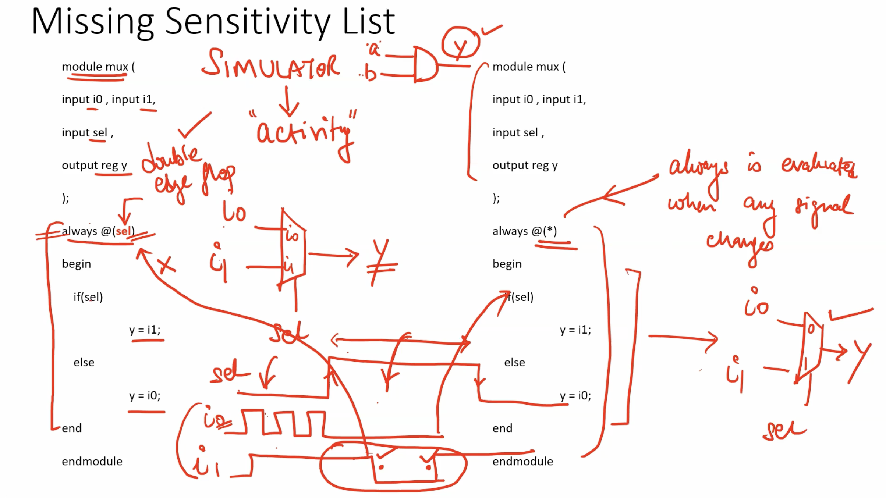

# Blocking/Non-blocking statements

- Comes into picture only when using always blocks.
- Inside always block , = means blocking , <= means non-blocking

  [D/B Blocking and Non-Blocking assignment](images/block-vs-nonblock.png)

  # Caveats with Blocking Assignments

  [Caveats-Blocking](images/caveats-block.png)

  [Caveats-Blocking](images/caveats-block1.png)

  [Caveats-Blocking](images/caveats-block3.png)

 - The above picture shows that both the code yields the sae synthesis output. But the simulations will be different. This causes a simulation-synthesis mismatch! It is very important to check the curcuit behaviour and match the output without any simulation-synthesis mismatch. This is why GLS is needed.
  

### Labs on GLS and Synthesis-Simulation Mismatch

### Labs on synth-sim mismatch for blocking statements

---

## Day 5

### If Case constructs

### Labs on "Incomplete If Case"

### Labs on "Incomplete overlapping Case"

### for loop and for generate

### Labs on "for loop" and "for generate"


